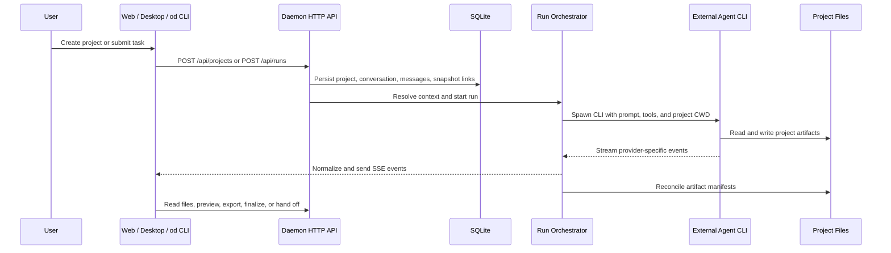

# Current Architecture and Secondary Development Guide

> Verified against the repository source on 2026-06-09.
>
> This document describes the **current implementation**, not only the original
> architecture intent. When it conflicts with an older design document, treat
> the source paths listed here and the current contracts as authoritative.

## 1. Purpose and reading order

This document is for engineers who need to understand, extend, or integrate
Open Design without accidentally crossing runtime boundaries.

Read it in this order:

1. Start with the business flow in [Section 3](#3-end-to-end-business-flow).
2. Use [Section 4](#4-runtime-and-data-boundaries) to understand ownership.
3. Choose the matching extension path in
   [Section 7](#7-secondary-development-playbook).
4. Re-run the analysis process in
   [Section 9](#9-repeatable-architecture-analysis-process) before making a
   structural change.

Related protocol-level documents:

- [`spec.md`](spec.md): product and design intent.
- [`architecture.md`](architecture.md): original topology and architecture
  design.
- [`agent-adapters.md`](agent-adapters.md): agent adapter protocol.
- [`skills-protocol.md`](skills-protocol.md): Skill protocol.
- [`modes.md`](modes.md): runtime modes.
- [`../specs/current/architecture-boundaries.md`](../specs/current/architecture-boundaries.md):
  current repository boundaries.
- [`../AGENTS.md`](../AGENTS.md): repository-wide development rules.

## 2. Architecture in one sentence

Open Design is a local-first design workbench where the daemon coordinates
projects, conversations, extension packages, and external Agent CLIs; Agents
write real project files; the web and desktop surfaces render and operate on
those durable artifacts through daemon HTTP APIs.

The system is artifact-centered rather than chat-centered:

- Chat is the interaction and orchestration surface.
- Project files and artifact manifests are the durable design result.
- SQLite records metadata, relationships, and product state.
- A running Agent process is temporary execution state.

## 3. End-to-end business flow



### Step 1: Create or import a Project

**Business goal:** establish the durable workspace in which all later
conversation, generation, review, and export work occurs.

**Primary entry points**

- HTTP: `POST /api/projects`
- Implementation: `apps/daemon/src/project-routes.ts`
- Shared types: `packages/contracts/src/api/projects.ts`

**What happens**

1. The daemon validates project identity, name, Skill, Design System, plugin,
   and requested location.
2. It creates the project metadata record in SQLite.
3. It creates a default conversation.
4. If a plugin is selected, it resolves and pins an immutable
   `AppliedPluginSnapshot`.
5. It creates or seeds the project directory and template files.

**Durable result**

- SQLite project, conversation, and extension relationships.
- Project files under `.od/projects/<id>/` by default, or under a trusted
  imported location.

**Invariant:** the project directory owns the user's actual files. SQLite must
not become a second copy of artifact file content.

### Step 2: Build the task context

**Business goal:** turn the user's request and the selected business package
into a deterministic execution context.

**Primary implementation**

- Plugin apply: `apps/daemon/src/plugins/apply.ts`
- Snapshot resolution: `apps/daemon/src/plugins/resolve-snapshot.ts`
- Snapshot contract: `packages/contracts/src/plugins/apply.ts`
- System prompt composition: `apps/daemon/src/prompts/system.ts`

**Context layers**

| Layer | Role |
| --- | --- |
| Skill | Reusable workflow, instructions, scripts, and assets |
| Design System | Brand-specific visual contract |
| Craft | Brand-independent quality rules |
| Plugin | Business package that binds inputs, context, capabilities, pipeline, and UI surfaces |
| AppliedPluginSnapshot | Frozen, persisted execution contract for one applied plugin state |

The snapshot is the reproducibility boundary. A run should use the pinned
snapshot instead of silently re-reading a changed plugin definition.

**Invariant:** plugin apply is pure; snapshot resolution is the explicit
side-effect boundary that persists and links the snapshot.

### Step 3: Submit a Run

**Business goal:** start one unit of Agent work while preserving a common API
for UI, CLI, MCP, SDK, and automation callers.

**Primary entry points**

- Web provider: `apps/web/src/providers/daemon.ts`
- HTTP: `POST /api/runs`
- Canonical handler and orchestration: `apps/daemon/src/server.ts`
- Request and event contracts: `packages/contracts/src/api/chat.ts`
- In-memory run registry: `apps/daemon/src/runs.ts`

**What happens**

1. The caller sends the project, conversation, prompt, selected agent, media,
   tool bundle, and optional plugin snapshot information.
2. The daemon resolves the plugin snapshot and selects an Agent if one was not
   explicitly selected.
3. For headless callers, the daemon can synthesize the required conversation
   and message records.
4. The daemon creates an in-memory Run and returns HTTP `202`.
5. The same Run is exposed as SSE through `/api/runs/:id/events`.

**Invariant:** all execution surfaces converge on the daemon's `/api/runs`
contract. A new caller must not create a private Agent execution path.

### Step 4: Prepare and spawn the Agent runtime

**Business goal:** give an external Agent CLI the correct project context and
normalize its provider-specific protocol.

**Primary implementation**

- Main run worker: `startChatRun` in `apps/daemon/src/server.ts`
- Runtime definitions: `apps/daemon/src/runtimes/defs/`
- Runtime stream parsers: `apps/daemon/src/*-stream.ts`
- Adapter protocol: [`agent-adapters.md`](agent-adapters.md)

Before spawning, the daemon resolves:

- Project CWD and safe file paths.
- Conversation transcript and attachments.
- Skill, Design System, Craft, plugin snapshot, and pipeline context.
- External MCP servers, memory, and scoped tool tokens.
- Runtime definition, binary, arguments, environment, and prompt input format.

The daemon then spawns the selected CLI and converts its native output into a
common event stream. Supported runtime families include stream JSON, JSON event
streams, ACP JSON-RPC, Pi RPC, and plain process streams.

**Invariant:** app business logic must not depend on one provider's native
event format. Provider differences belong in runtime definitions and parsers.

### Step 5: Execute work against real project files

**Business goal:** let the Agent inspect and modify the durable design
workspace, rather than returning only chat text.

**Primary implementation**

- Safe project file operations: `apps/daemon/src/projects.ts`
- Artifact manifest validation: `apps/daemon/src/artifact-manifest.ts`
- Artifact contracts: `packages/contracts/src/api/artifacts.ts`

Agents run with the project directory as their working context and write real
files. The daemon validates API-mediated file operations, prevents path and
symlink escapes, and reconciles HTML artifact sidecar manifests at run end.

An `ArtifactManifest` identifies the artifact kind, entry point, renderer,
status, export formats, supporting files, and optional provenance.

**Invariant:** an artifact is not just an SSE message. It must be recoverable
from project files and its manifest after the run has ended.

### Step 6: Stream progress and interactive tool results

**Business goal:** make long-running Agent work observable and allow selected
interactive tools to continue a live turn.

**Primary implementation**

- Run event registry and JSONL logs: `apps/daemon/src/runs.ts`
- SSE consumption: `apps/web/src/providers/daemon.ts`
- Interactive tool result endpoint: `POST /api/runs/:id/tool-result`
- Claude stream-json handling: `apps/daemon/src/claude-stream.ts`

The daemon keeps active Run objects, child processes, subscribers, and recent
events in memory. It can also write per-run `events.jsonl` logs. Claude's
stream-json mode keeps stdin open while host answers are pending; other Agents
normally receive a text prompt and closed stdin.

**Current limitation:** active Run state is not durable orchestration state. A
daemon restart loses the live child process and in-memory registry, even when
event logs remain on disk.

### Step 7: Preview, review, and refine artifacts

**Business goal:** render generated outputs, collect feedback, and continue
editing without leaving the project workspace.

**Primary implementation**

- Renderer registry: `apps/web/src/artifacts/renderer-registry.ts`
- HTML load-mode decision: `apps/web/src/components/file-viewer-render-mode.ts`
- File and preview APIs: `apps/daemon/src/project-routes.ts`
- Comments and tool UI: `apps/web/src/components/`

The web app selects a renderer from the artifact manifest. HTML previews use
either URL loading or `srcDoc`; features that inject preview bridges must use
the `srcDoc` path. Feedback and further requests are submitted through the same
project, conversation, and run APIs.

**Invariant:** preview behavior must preserve sandbox, origin, and bridge
requirements. A renderer change is both a contract change and a UI change.

### Step 8: Export, finalize, hand off, or automate

**Business goal:** turn the working artifact into a deliverable, downstream
Agent task, or repeatable routine.

**Primary implementation**

- Import/export routes: `apps/daemon/src/import-export-routes.ts`
- Finalization: `apps/daemon/src/finalize-design.ts`
- Handoff: `apps/daemon/src/handoff-design.ts`
- Routine scheduler: `apps/daemon/src/routines.ts`
- Headless surface: `apps/daemon/src/cli.ts`

Finalization packages the transcript, active Design System, and artifacts.
Handoff creates a next-Agent prompt and provenance-aware output. Automations
reuse the same project/conversation creation and `startChatRun` execution path.

**Invariant:** a user-facing capability must be reachable through both the web
UI and the `od` CLI, and both surfaces must call the same daemon API shape.

## 4. Runtime and data boundaries

### 4.1 Logical component ownership

| Component | Owns | Must not own |
| --- | --- | --- |
| `apps/web` | User workflows, rendering, preview, API client state | Daemon internals or direct Agent spawning |
| `apps/daemon` | HTTP API, business orchestration, persistence, Agent spawning, artifacts | Provider-specific UI behavior |
| `apps/desktop` | Electron shell and sidecar discovery | Daemon/web business logic |
| `apps/packaged` | Packaged sidecar startup and `od://` glue | Product workflows |
| `packages/contracts` | Pure shared DTOs, events, and error shapes | Node, browser, Next.js, SQLite, or daemon APIs |
| `packages/sidecar-proto` | Open Design sidecar protocol and identity | Generic process implementation |
| `packages/sidecar` | Generic bootstrap, IPC, paths, and runtime files | Product business logic |
| `packages/platform` | Generic OS process primitives | Open Design-specific orchestration |
| `tools/dev` | Local development lifecycle | App business logic |
| `tools/pack` | Packaged build, install, update, and release harness | App business logic |

### 4.2 Three storage classes

| Storage | Current owner | Examples |
| --- | --- | --- |
| SQLite | `apps/daemon/src/db.ts` | Projects, conversations, messages, tabs, routines, plugins |
| Filesystem | `.od/` and project directories | Actual artifacts, manifests, uploads, run event logs |
| Memory | Daemon process | Active Runs, SSE subscribers, child processes, ACP sessions |

The default daemon data root is `<project-root>/.od`. `OD_DATA_DIR` relocates
all daemon data; `OD_MEDIA_CONFIG_DIR` relocates only media credentials.

### 4.3 Process and deployment model

`tools-dev` is the only supported local lifecycle control plane. It starts and
discovers daemon, web, and desktop processes using namespace-scoped sidecar
identity and IPC.

Sidecar process stamps contain exactly:

```text
app, mode, namespace, ipc, source
```

The practical deployment shapes are:

1. Local web plus local daemon.
2. Desktop or packaged Electron with local sidecars.
3. Hosted web connected to a reachable local daemon.
4. Headless daemon driven by `od`, MCP, SDK, or an external Agent.

Do not infer process identity from ports. Ports are transient transport
details; namespace and IPC identify the runtime.

## 5. Security model and residual risk

Implemented controls include:

- Path traversal and descendant-symlink escape prevention in project file
  operations.
- Loopback host/origin validation and cross-origin rejection.
- Sandboxed preview iframes and content security policy.
- Scoped per-run tool tokens with endpoint and operation grants.
- Plugin trust, capability gates, and immutable applied snapshots.
- Authenticated desktop folder-import paths.

The largest residual risk is the execution power granted to external Agent
CLIs. Some runtime definitions intentionally use non-interactive permission
flags such as `bypassPermissions`, `--yolo`, `--allow-all-tools`, or optional
`danger-full-access`. The effective safety boundary therefore depends on the
selected runtime, its own sandbox, the project CWD, and daemon-issued tool
capabilities.

## 6. Architecture assessment

### Strengths

- The artifact-centered model produces durable, inspectable outputs.
- UI, CLI, MCP, SDK, and automation reuse one daemon execution contract.
- External Agent CLIs provide mature execution loops without duplicating model
  providers and tool engines inside Open Design.
- Immutable plugin snapshots improve reproducibility and provenance.
- Skill, Design System, Craft, and Plugin have distinct responsibilities.
- Shared contracts make web/daemon drift detectable by TypeScript.

### Risks and pressure points

- `apps/daemon/src/server.ts` is a large orchestration and route composition
  hotspot, increasing regression and review cost.
- Runtime adapters contain unavoidable provider-specific branches that need
  replay tests to prevent protocol drift.
- Active Runs are not restart-durable.
- Older design documents can drift from current storage and runtime behavior.
- The daemon has a broad fault and security domain because it owns APIs,
  storage, extension resolution, and Agent spawning.

### Recommended internal direction

Keep the deployment as a modular monolith unless scaling evidence requires
otherwise, but make these internal layers explicit:

```text
API Layer
  -> Application Services
    -> Run Orchestrator
      -> Agent Runtime Gateway
    -> Project / Artifact Store
    -> Extension Platform
  -> Platform / Sidecar
```

The goal is not to create services prematurely. The goal is to stop route
composition, application decisions, provider protocols, and persistence from
accumulating in the same module.

## 7. Secondary development playbook

### Add a user-facing capability

Implement all three surfaces in one change:

1. Add shared request/response types under `packages/contracts/src/api/`.
2. Add the daemon `/api/*` endpoint in the appropriate `*-routes.ts` module.
3. Add the web UI surface under `apps/web/src/`.
4. Add the `od <capability>` subcommand in `apps/daemon/src/cli.ts` and register
   it through `SUBCOMMAND_MAP`.
5. Verify UI and CLI use the same endpoint and payload shape.

### Add an Agent runtime

1. Add a runtime definition under `apps/daemon/src/runtimes/defs/`.
2. Reuse an existing protocol parser when the Agent speaks a known protocol.
3. Add a focused parser only when the wire protocol is genuinely different.
4. Add or update a mock CLI trace under `mocks/`.
5. Replay the trace and verify normalized start, output, usage, tool, error,
   and end events.
6. Document permission flags and their security consequences.

### Add a Skill, Design System, Craft rule, or Plugin

- Use a **Skill** for a reusable workflow and supporting assets.
- Use a **Design System** for brand-specific visual rules.
- Use **Craft** for universal quality rules.
- Use a **Plugin** when the business flow needs frozen inputs, context,
  capabilities, pipeline steps, or generated UI.

Do not hide business orchestration in a Skill when reproducibility requires an
`AppliedPluginSnapshot`.

### Add an artifact type or renderer

1. Extend the artifact contract in `packages/contracts/src/api/artifacts.ts`.
2. Update daemon validation and manifest reconciliation.
3. Add the web renderer in `apps/web/src/artifacts/renderer-registry.ts`.
4. Decide whether preview bridges require `srcDoc`.
5. Add export/finalize support when the type is deliverable.
6. Verify manifest preservation across write, rename, export, and handoff.

### Change persistence or lifecycle behavior

Before changing storage, startup, ports, namespaces, or process discovery:

1. Read `packages/sidecar-proto`, `packages/sidecar`, and `packages/platform`
   boundaries.
2. Read the matching `tools/dev` or `tools/pack` `AGENTS.md`.
3. Preserve the five-field process stamp.
4. Test two concurrent namespaces.
5. Confirm logs and runtime files stay namespace-scoped.

## 8. Verification checklist for architecture changes

Run the smallest checks that can prove the changed boundary, then the required
repository checks.

```bash
pnpm guard
pnpm typecheck
```

Examples of focused checks:

```bash
pnpm --filter @open-design/contracts test
pnpm --filter @open-design/daemon test
pnpm --filter @open-design/web typecheck
pnpm --filter @open-design/web test
pnpm --filter @open-design/tools-dev build
```

For runtime parser changes, replay a recorded mock trace before spending
provider budget:

```bash
export PATH="$PWD/mocks/bin:$PATH"
export OD_MOCKS_TRACE=<8-char-id>
export OD_MOCKS_NO_DELAY=1
```

For visible workflow changes, start the supported local lifecycle and verify
the real user path:

```bash
pnpm tools-dev run web --daemon-port <port> --web-port <port>
```

## 9. Repeatable architecture analysis process

Use this process to refresh this document or assess a proposed secondary
development change.

### Phase 1: Establish source-of-truth order

Use this priority when sources disagree:

1. Current contracts and executable source.
2. Tests that encode intended behavior.
3. Current `AGENTS.md` boundary rules.
4. `specs/current/`.
5. General docs and historical architecture intent.

Record every contradiction instead of silently choosing one description.

### Phase 2: Map the business flow

Start from observable user actions, not directories:

1. Create/import a Project.
2. Resolve task context and extension package.
3. Submit a Run.
4. Prepare and spawn an Agent.
5. Read/write project artifacts.
6. Stream progress and answer tools.
7. Preview/review/refine.
8. Export/finalize/handoff/automate.

For each step, record:

- Business goal.
- Input and output.
- API/CLI/UI entry points.
- Owning implementation module.
- Durable state written.
- Invariants and failure modes.
- Intended extension point.

### Phase 3: Trace one path end to end

Use targeted search instead of reading the repository linearly:

```bash
rg -n "app.post\\('/api/projects|app.post\\('/api/runs" apps/daemon/src
rg -n "streamViaDaemon|/api/runs" apps/web/src/providers/daemon.ts
rg -n "startChatRun|composeSystemPrompt|spawn\\(" apps/daemon/src/server.ts
rg -n "writeProjectFile|ArtifactManifest" apps/daemon packages/contracts
rg -n "AppliedPluginSnapshot|resolvePluginSnapshot" apps/daemon packages/contracts
```

Then read the matching contracts, implementation, and tests together. Do not
infer behavior from a route name or interface alone.

### Phase 4: Classify state and ownership

For every state object, answer:

1. Is it durable or temporary?
2. Is the owner SQLite, filesystem, browser state, or daemon memory?
3. What is the recovery behavior after daemon restart?
4. Which package owns the contract?
5. Which module is allowed to mutate it?

This phase catches common false assumptions, such as treating run event logs as
restart-durable orchestration or treating SQLite as the owner of artifact
content.

### Phase 5: Audit cross-runtime boundaries

Check that:

- Web does not import daemon private source.
- Contracts remain pure TypeScript.
- Agent-specific protocols stay behind runtime adapters.
- User-facing capabilities close HTTP, UI, and CLI surfaces together.
- Sidecar identity uses namespace and IPC rather than guessed ports.
- External CLI permission posture is explicit.

### Phase 6: Validate the conclusion

Use at least two forms of evidence for high-impact conclusions:

- Source plus contract.
- Source plus test.
- Runtime behavior plus persisted state.

Label the output clearly:

- **Current fact:** directly verified in source or runtime.
- **Architecture judgment:** interpretation of trade-offs.
- **Recommendation:** proposed future direction.

Do not present a recommendation as if it is already implemented.

## 10. Verified source map

| Concern | Primary source |
| --- | --- |
| Project creation | `apps/daemon/src/project-routes.ts` |
| Project/conversation contracts | `packages/contracts/src/api/projects.ts` |
| Run request/events | `packages/contracts/src/api/chat.ts` |
| Web Run client | `apps/web/src/providers/daemon.ts` |
| Run orchestration and Agent spawn | `apps/daemon/src/server.ts` |
| Active Run registry and event logs | `apps/daemon/src/runs.ts` |
| Runtime definitions | `apps/daemon/src/runtimes/defs/` |
| SQLite persistence | `apps/daemon/src/db.ts` |
| Project files and path safety | `apps/daemon/src/projects.ts` |
| Artifact contract | `packages/contracts/src/api/artifacts.ts` |
| Plugin apply and snapshots | `apps/daemon/src/plugins/`, `packages/contracts/src/plugins/` |
| Artifact rendering | `apps/web/src/artifacts/renderer-registry.ts` |
| Finalize and handoff | `apps/daemon/src/finalize-design.ts`, `apps/daemon/src/handoff-design.ts` |
| Automations | `apps/daemon/src/routines.ts` |
| CLI surface | `apps/daemon/src/cli.ts` |
| Sidecar identity | `packages/sidecar-proto/src/index.ts` |
